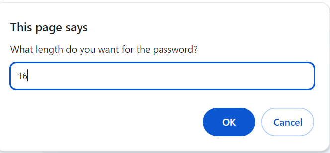
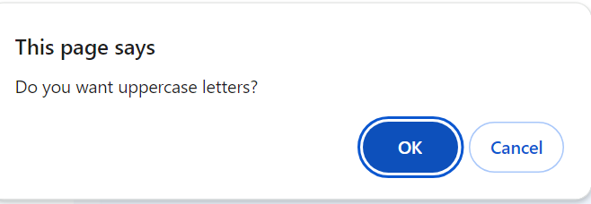
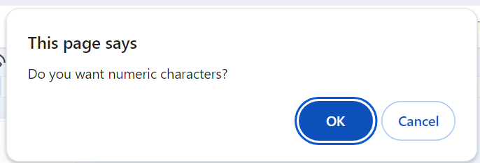
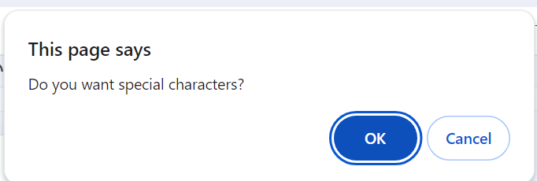
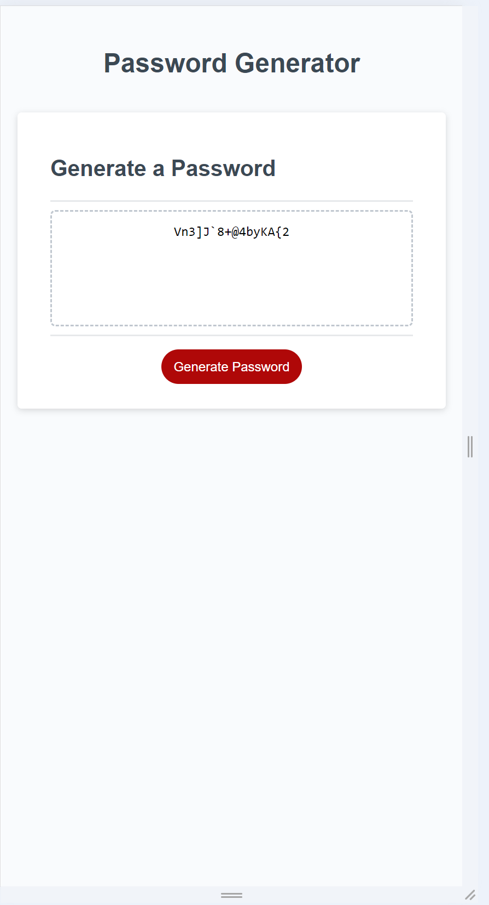

# Password_Generator

## Description

Generate a strong password, based on an employee selecting a group of criteria.
The user can select the length(required) and at least one of the character sets uppercase, lowercase, numeric, or special characters to create the random generated password.

var upperCase = "ABCDEFGHIJKLMNOPQRSTUVWXYZ";
var lowerCase = "abcdefghijklmnopqrstuvwxyz";
var numeric = "0123456789";
var specialCharacters = "!#$%&'()\*+,-./:;<=>?@[]^\_`{|}~";

The code concatenates the above strings into an array. The first iteration uses the map function on the array to insure at least one character from each set is used, then runs the createRandom() function to generate the initial random set.
The array is converted into a string and random characters are create in a for loop of the initial password length to the user's entered length to complete the random password.

for (var i = password.length; i < passwordLength; i++) {
password += createRandom(passwordResult);
}

## Installation

N/A

## Usage

The user is presented with a series of prompts to create a secure password.

The length of the password must be between 8 and 128 characters and the character types are either upper, lower, numeric, or special characters as displaye in the prompts above. At least on character type must be selected.
After the prompts are answered, a password is created based on the user's selection(s). The password is displayed on the page in a text area.

GitHub Repository: https://github.com/rethomas67/Password_Generator/
GitHub page link: https://rethomas67.github.io/Password_Generator/

## Credits

N/A

## License

N/A
